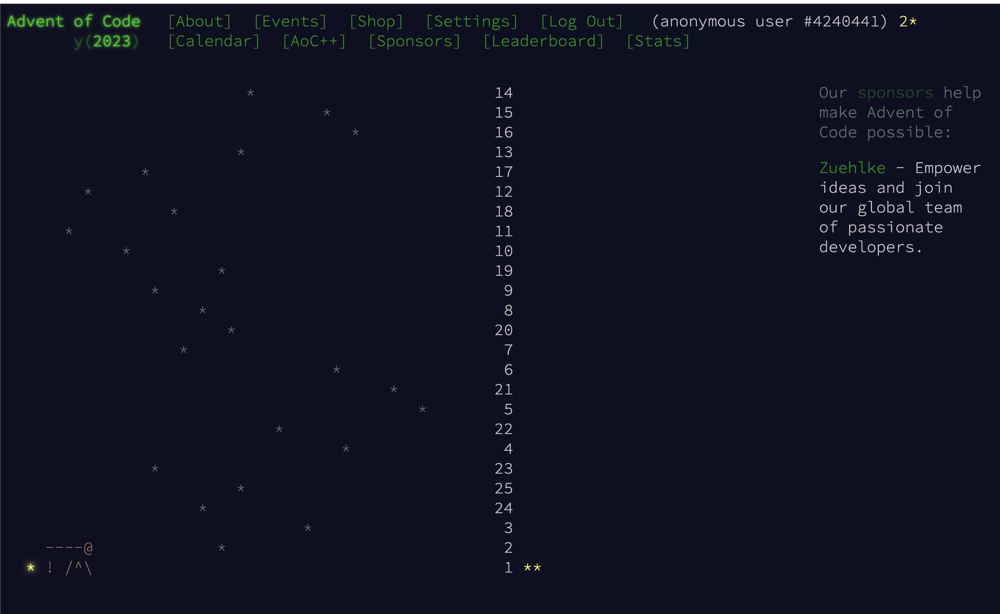
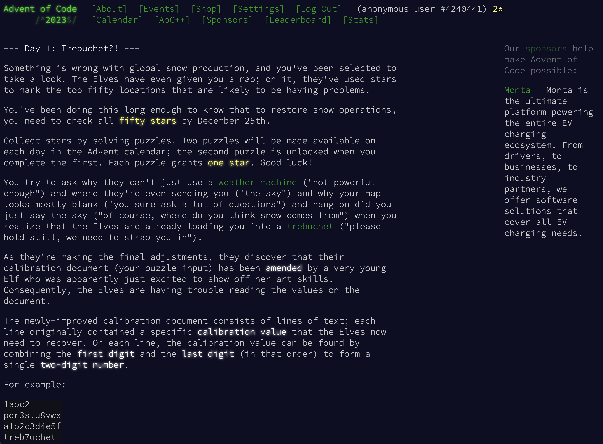
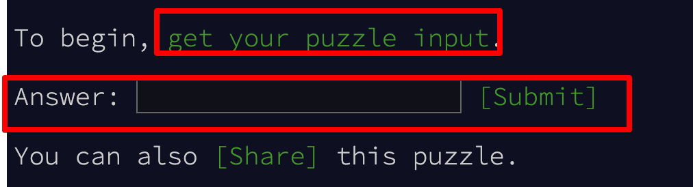
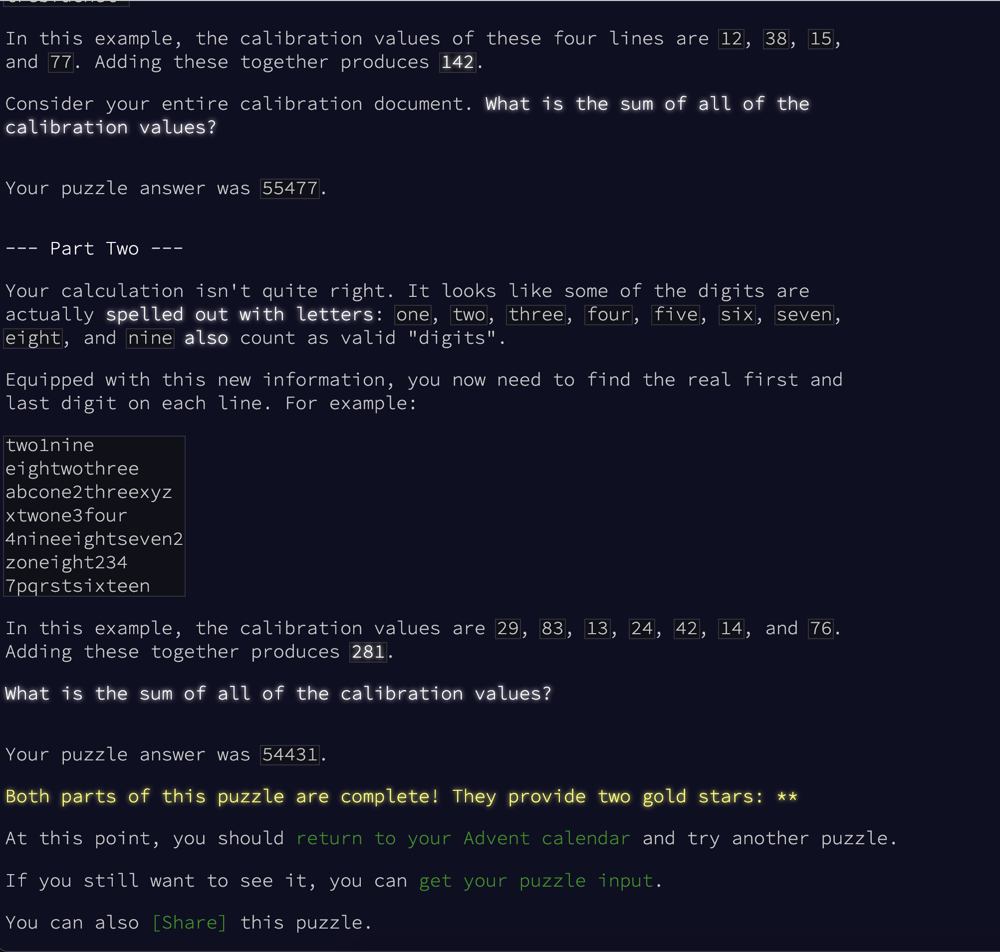
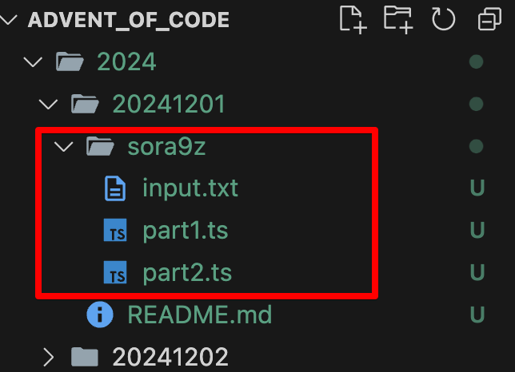

# advent_of_code

이 레포지토리는 Advend of Code에 참가자들이 서로의 해결 방법을 공유하고 기록하며 토론하기 위한 레포지토리입니다.
매년 12월 1일부터 25일까지 도장깨기를 하면서 한 해를 마무리하는 좋은 기회가 될 것이라 기대합니다 😁

## Advent of Code란?

- [Advent of Code](https://adventofcode.com/)는 매년 12월 1일부터 크리스마스인 12월 25일까지 매일 새로운 프로그래밍 퍼즐을 제공하는 온라인 이벤트입니다.
- 이 퍼즐들은 다양한 프로그래밍 기술과 알고리즘을 테스트하며, 각각의 문제를 해결함으로써 참가자들은 점점 더 어려워지는 도전을 경험할 수 있습니다.
- 퍼즐은 UTC-5 기준으로 자정, 한국시간으로는 오후 2시에 공개됩니다.

### 사전 준비

- 문제를 풀고 제출하기 위해서는 회원가입을 해야합니다.

### 문제의 구성과 문제를 푸는 방법

- 하루에 하나의 퍼즐이 공개됩니다. 각 퍼즐은 2개 파트로 구성되어 있고, 첫 파트를 해결하지 못하면 다음 파트 문제를 확인하실 수 없습니다.
- 예를 들어 2023년 12월 1일에 공개된 문제를 확인해보겠습니다.
  

  - 참고로 문제를 풀면 문제 옆에 "`\*`" 표시가 생깁니다.

  - 두 개의 파트를 모두 풀면 문제 옆에 두개의 "`\*`" 표시가 생깁니다.
  - 위의[2023 12월 1번 문제](https://adventofcode.com/2023/day/1)를 확인해보겠습니다

  - Part1의 문제를 볼 수 있고, 문제에 대한 설명을 확인할 수 있습니다.

    

  - 문제에 대한 Input은 사용자마다 다르며 아래와 같이 `get your puzzle input`을 클릭하면 확인할 수 있습니다.

    

  - 문제를 풀고 input을 받아 직적 실행하여 나온 결과를 아래와 같이 입력하고 `submit을` 누르면 제출이 완료되고 통과 여부를 확인할 수 있습니다.

  - 첫 번째 Part를 풀었다면 두 번째 Part를 풀 수 있습니다.

    

    - 만약 첫번째 파트를 좋은 방법으로 풀었다면, 두번째 파트는 쉽게 해결될 수도 있습니다.

    - 보통 첫 번째 Part에 약간의 고도화를 요구하는 문제로 구성됩니다.

- 이전 년도 문제는 아래의 [링크](https://adventofcode.com/events)에서 확인할 수 있습니다.

- 자세한 정보는 [About Advent of Code](https://adventofcode.com/2024/about)를 참고해주세요

## 참여 방법

- 현재 레포지토리를 클론합니다.

- 브랜치를 아래와 같이 생성합니다.

  - `feature/20241201/github_id`
  - 다른 사람의 작업에 대한 영향을 주지 않기 위해 브랜치를 생성합니다.

- 해당하는 년도/월/일 에 해당하는 폴더에 본인의 github id로 폴더를 생성하고 문제를 풀었던 코드를 올려주세요

  - 예를 들어 2024년 12월 1일에 문제를 풀었다면 `2024/20241201/github_id` 디렉토리를 생성하고 문제를 풀었던 코드를 올려주세요

- 작업 완료 후 본인의 브랜치를 메인 브랜치로 PR을 생성합니다.

  - PR을 생성하는 이유는 문제 풀이에 대해 서로 리뷰하고 토론할 수 있도록 하기 위함입니다.
  - 토론은 필수가 아닙니다.
  - 병합은 언제든 본인이 필요에 따라 진행합니다.

- 문제를 풀기 위해 언어는 자유롭게 선택해주세요.
  
